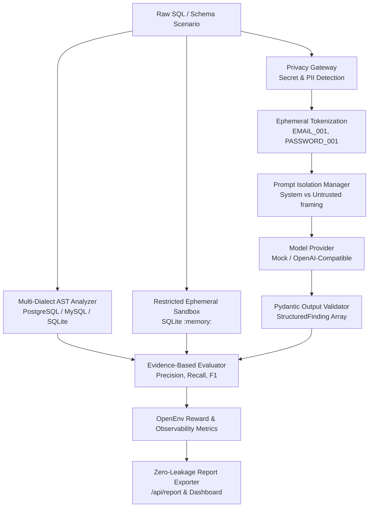

# SQL Review Environment V2 — Privacy-Preserving Enterprise AI SQL Review & Agent Evaluation

**Author:** Ansh Kumar Singh  
**Status:** Round 1 - Meta PyTorch OpenEnv Hackathon (Upgraded to V2 Enterprise Benchmark)

`sql-review-env` V2 is an open, privacy-preserving, enterprise-oriented RL environment designed to train and evaluate AI agents on **SQL Code Review**, **Database Security**, and **Query Performance Optimization**.

---

## Why This Exists

Automated code review agents are rapidly being deployed in engineering workflows. However, existing benchmarks either lack privacy controls, rely on fragile keyword matching, or fail to isolate LLM evaluation from untrusted inputs. 

`sql-review-env` V2 addresses these challenges by providing:
1. **Privacy Boundary**: Pre-inference tokenization redacting sensitive credentials and PII.
2. **Prompt Injection Isolation**: Structural delimiter framing ensuring untrusted code cannot override agent system instructions.
3. **Evidence-Based Multi-Dimensional Evaluator**: Precision/Recall/F1 metrics scoring issue identification, line numbers, evidence quality, severity, and remediation recommendations.
4. **Deterministic Multi-Dialect Scenario Generator**: Seed-reproducible dynamic task creation across `PostgreSQL`, `MySQL`, and `SQLite`.
5. **Restricted Analysis Sandbox**: In-memory ephemeral SQLite container for query plan (`EXPLAIN QUERY PLAN`) diagnostic verification.

---

## Architecture & Trust Boundary



---

## V2 Module Overview

| Component | Directory | Description |
| :--- | :--- | :--- |
| **Privacy Foundation** | `privacy/` | Redacts API keys, credentials, tokens, PII via ephemeral tokenization before LLM submission. Fail-closed `ENTERPRISE_PRIVACY_MODE`. |
| **Security & Isolation** | `security/` | Structural trust boundary separation framing untrusted SQL separately from system prompt. Advisory injection scanner. |
| **SQL AST Analysis** | `sql_analysis/` | Multi-dialect (`sqlglot`) AST analysis generating verified ground truth while distinguishing *confirmed* facts vs *candidate* inferences. |
| **Evidence Evaluator** | `grading/` | 5-dimensional evaluation (issue, line, evidence, severity, fix) with precision/recall/F1 and strict false-positive penalties (-0.75). |
| **Scenario Generator** | `scenarios/` | Deterministic, seed-reproducible dynamic benchmark generation supporting `postgres`, `mysql`, and `sqlite`. |
| **Restricted Sandbox** | `sandbox/` | In-memory ephemeral SQLite (`:memory:`) executing `EXPLAIN QUERY PLAN` with read-only fail-closed execution policies. |
| **Enterprise Observability** | `reporting/` | Safe JSON/HTML report exporter with zero secret leakage guarantees and `/metrics` observability API. |

---

## OpenEnv API Endpoints

- `POST /reset`: Reset environment to baseline task (`easy-sql-review`, `medium-sql-review`, `hard-sql-review`, `security-extreme`, `performance-optimization`) or dynamic scenario (`/reset?task=generated&seed=12345&dialect=postgres&difficulty=hard`).
- `POST /step`: Progress environment using structured `SQLReviewAction` or legacy `review_comment`.
- `GET /state`: Fetch current observation state.
- `GET /metrics`: Aggregated OpenEnv observability metrics.
- `GET /api/report`: Machine-readable `BenchmarkReport` JSON.
- `GET /`: Real-time V2 Enterprise Observability Dashboard.

---

## Quick Start

### Local Installation & Server Execution
```bash
git clone https://github.com/0ANSHKUMARSINGH4/sql-review-env.git
cd sql-review-env
pip install -r requirements.txt

# Run server
uvicorn server.app:app --host 0.0.0.0 --port 7860
```

### Run Full Test Suite
```bash
python -m pytest tests/ -v
```

### Reproducible Baseline Evaluation (No-LLM Mode)
```bash
export MODEL_PROVIDER=mock
export LLM_ENABLED=false
python inference.py
```

---

## Docker Support

```bash
docker build -t sql-review-env .
docker run -p 7860:7860 sql-review-env
```

---

## Security & Privacy Disclaimers

- **Security & Privacy Boundary**: The privacy gateway and prompt isolation manager provide application-level safeguards for benchmark evaluation. They do NOT constitute formal enterprise compliance certification or a guarantee of perfect privacy against all novel attack techniques.
- **Database Sandbox**: The analysis sandbox operates in an ephemeral in-memory SQLite container with read-only application controls. It is designed for benchmark query plan inspection and does not connect to production databases.