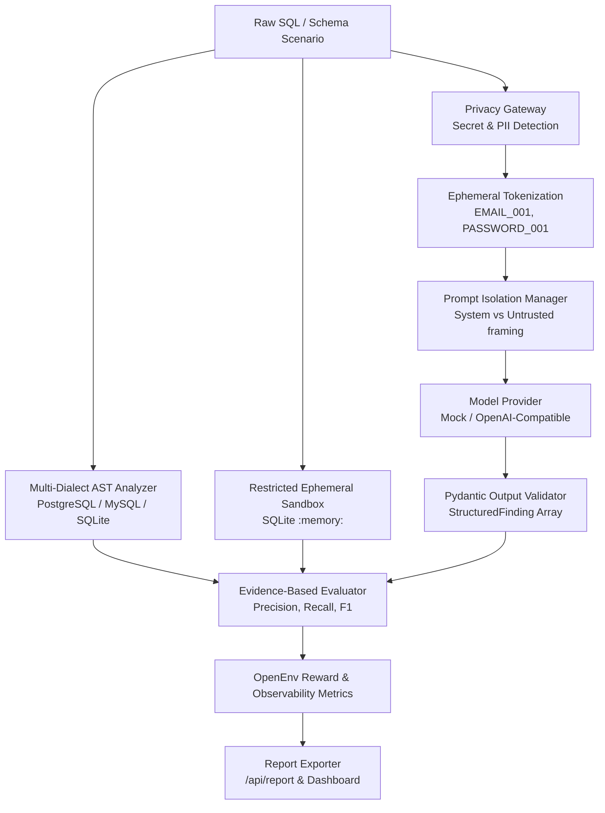

# SQL Review Environment V2

An OpenEnv-compatible, privacy-preserving benchmark for evaluating AI agents on SQL security and performance review.

[](https://github.com/0ANSHKUMARSINGH4/sql-review-env/actions)

---

## What Is This?

`sql-review-env` V2 is an open, application-level evaluation environment designed to measure how effectively AI code-review agents analyze database SQL queries and schemas for security vulnerabilities (e.g., SQL Injection) and performance bottlenecks (e.g., N+1 queries, missing indexes, inefficient JOINs).

Unlike static linters or unconstrained LLM prompts, this environment simulates a structured code review flow using the **OpenEnv** specification. It provides pre-inference privacy safeguards, structural prompt isolation, multi-dialect AST validation, ephemeral query-plan analysis, and multi-dimensional scoring.

---

## Why It Is Interesting

Evaluating code-review agents purely via simple keyword detection or unguided string matching often leads to high false-positive rates and benchmark gaming. `sql-review-env` V2 evaluates agents across multiple technical dimensions:

- **Security Identification**: Accurate categorization of structural vulnerabilities.
- **Line Location Precision**: Pinpointing exact line numbers where issues occur.
- **Evidence Quality**: Distinguishing substantive technical explanations from vague comments.
- **Severity & Remediation**: Assessing proposed SQL fixes and severity classifications.
- **False-Positive & Duplicate Penalties**: Penalizing keyword spamming (-0.75 penalty) to prevent benchmark gaming.
- **Seed Reproducibility**: Guaranteeing exact scenario generation across execution runs.

---

## Key Capabilities

- **Privacy Gateway**: Application-level credential and PII redaction using ephemeral tokenization (`<EMAIL_001>`, `<PASSWORD_001>`).
- **Prompt Isolation**: Structural delimiter framing separating System Instructions from untrusted SQL text.
- **SQLGlot AST Analysis**: Multi-dialect (`PostgreSQL`, `MySQL`, `SQLite`) AST parsing producing confirmed vs. candidate ground-truth issues.
- **Evidence-Based Evaluation**: Multi-dimensional scoring calculating Precision, Recall, F1, Location Accuracy, and Fix Accuracy.
- **Deterministic Scenario Generator**: Seed-reproducible dynamic benchmark generation across `easy`, `medium`, and `hard` difficulties.
- **Restricted SQLite Sandbox**: In-memory ephemeral SQLite (`:memory:`) analysis executing `EXPLAIN QUERY PLAN` with fail-closed read-only policies.
- **Enterprise Observability & Reporting**: Safe JSON/HTML report exports with redacted token maps and machine-readable `/metrics` APIs.
- **No-LLM Mode**: Deterministic offline benchmark evaluation mode using `NO_LLM_MODE=true` or `LLM_ENABLED=false`.
- **OpenEnv API Compatibility**: Full support for standard `/reset`, `/step`, `/state`, and `/health` endpoints.

---

## Architecture



---

## How an Evaluation Works

1. **Load Scenario**: The environment initializes a baseline or seed-generated SQL task.
2. **Sanitize Context**: The Privacy Gateway detects sensitive literals and tokenizes them into ephemeral placeholders.
3. **Frame Prompt**: The Prompt Isolation Manager wraps sanitized SQL and schema in structural delimiters separate from System Instructions.
4. **Invoke Provider**: The model provider generates structured findings (or mock response in No-LLM mode).
5. **Validate Schema**: Model output is validated via Pydantic (`StructuredFinding` models).
6. **Analyze AST**: SQLGlot parses the query to generate confirmed ground-truth AST evidence.
7. **Obtain Sandbox Plan**: The query executes in an ephemeral in-memory SQLite database to capture `EXPLAIN QUERY PLAN` evidence.
8. **Evaluate Findings**: The Evidence-Based Evaluator scores the agent's response against ground truth.
9. **Return Reward & Metrics**: OpenEnv observation, reward, and safe observability metrics are updated.

---

## Example

### Input (Synthetic Benchmark SQL)
```sql
SELECT * FROM users 
WHERE email = 'test@example.invalid' 
AND password = 'TEST_PASSWORD_123';
```

### Environment Processing
1. **Privacy Gateway**: Tokenizes `test@example.invalid` $\rightarrow$ `<EMAIL_001>` and `TEST_PASSWORD_123` $\rightarrow$ `<PASSWORD_001>`.
2. **AST Analysis**: Identifies `SELECT *` as a confirmed `unnecessary_columns` finding.
3. **Model Provider**: Receives only sanitized query string.
4. **Evaluator**: Compares model's submitted `StructuredFinding` against verified ground truth.

---

## Evaluation Metrics

- **Precision**: Proportion of agent findings that match valid ground-truth issues.
- **Recall**: Proportion of true ground-truth issues successfully identified.
- **F1 Score**: Harmonic mean of Precision and Recall.
- **Location Accuracy**: Ratio of findings specifying the correct 1-indexed SQL line number.
- **Fix Accuracy**: Assessment of proposed remediation code quality.
- **False-Positive Penalty**: `-0.75` score deduction for unverified or incorrect issue claims.
- **Duplicate Penalty**: `-0.25` score deduction for duplicate issue submissions.

---

## Technical Architecture

| Component | Technology | Purpose |
| :--- | :--- | :--- |
| **API Server** | FastAPI / Uvicorn | OpenEnv web server hosting `/reset`, `/step`, `/state`, `/metrics`. |
| **AST Parser** | SQLGlot (v30.17.0) | Multi-dialect (`postgres`, `mysql`, `sqlite`) AST parsing and analysis. |
| **Analysis Sandbox** | SQLite (`:memory:`) | In-memory query-plan (`EXPLAIN QUERY PLAN`) diagnostic verification. |
| **Validation** | Pydantic v2 | Schema validation for observations, actions, findings, and reports. |
| **Model Provider** | OpenAI API / Mock | Inference client abstraction supporting real LLMs or deterministic mocks. |
| **Testing** | pytest | Automated test suite verifying security, privacy, and evaluation logic. |

---

## OpenEnv API

- `POST /reset`: Reset environment to baseline task (`easy-sql-review`, `medium-sql-review`, `hard-sql-review`, `security-extreme`, `performance-optimization`) or dynamic seed (`/reset?task=generated&seed=12345&dialect=postgres&difficulty=hard`).
- `POST /step`: Progress environment using structured `SQLReviewAction` or legacy `review_comment`.
- `GET /state`: Return current observation state (`query`, `schema_context`, `feedback_history`, `issues_remaining`).
- `GET /health`: Health check endpoint (`{"status": "healthy"}`).
- `GET /metrics`: Aggregated OpenEnv observability metrics.
- `GET /api/report`: Machine-readable `BenchmarkReport` JSON.
- `GET /`: V2 Enterprise Observability Web Dashboard.

---

## Quick Start

### 1. Clone & Set Up Environment
```bash
git clone https://github.com/0ANSHKUMARSINGH4/sql-review-env.git
cd sql-review-env

# Create virtual environment
python -m venv .venv
# On Windows: .venv\Scripts\activate
# On Linux/macOS: source .venv/bin/activate

# Install dependencies
pip install -r requirements.txt
```

### 2. Run Test Suite
```bash
python -m pytest tests/ -v
```

### 3. Start Local Server
```bash
uvicorn server.app:app --host 0.0.0.0 --port 7860
```
- **Dashboard**: `http://localhost:7860/`
- **Health Check**: `http://localhost:7860/health`

---

## No-LLM Mode

For deterministic offline benchmark testing without external LLM API keys:

```bash
export MODEL_PROVIDER=mock
export LLM_ENABLED=false
python inference.py
```

*Note: Mock provider outputs are strictly for deterministic pipeline validation and offline testing. They do NOT represent real LLM performance capabilities.*

---

## Docker

Build and run using the project Dockerfile:

```bash
docker build -t sql-review-env .
docker run -p 7860:7860 sql-review-env
```

---

## Testing

The project includes an automated test suite covering privacy boundaries, prompt isolation, AST parsing, evidence evaluation, scenario determinism, sandbox security, and API endpoints.

- **Verified Baseline**: **70 automated tests passing** (`python -m pytest tests/ -v`).
- **Continuous Integration**: GitHub Actions workflow (`.github/workflows/tests.yml`) executes the test suite automatically on push and pull requests to `main`.

---

## Security & Privacy Controls

`sql-review-env` V2 implements application-level security and privacy safeguards:
- **Secret Detection**: Regex and heuristic detection of credentials, API keys, and tokens.
- **PII Tokenization**: Ephemeral tokenization replacing sensitive values with safe placeholders.
- **Ephemeral Token Mapping**: Token mappings remain internal to environment memory and are never exported to reports or APIs.
- **Prompt Isolation**: System instructions framed separately from untrusted SQL text.
- **Restricted Sandbox**: In-memory SQLite sandbox with read-only policies blocking DDL, DML, `ATTACH`, `DETACH`, `PRAGMA`, and `load_extension`.
- **No Production DB Access**: Execution operates strictly in-memory without external database connections.

See [SECURITY.md](SECURITY.md) for full threat model documentation.

---

## Limitations

- **Heuristic Detection**: Secret and PII detection relies on pattern heuristics and cannot guarantee detection of all proprietary credential formats.
- **Prompt Isolation**: Structural isolation reduces prompt injection risk but cannot guarantee prevention against all novel jailbreak techniques.
- **Application-Level Sandbox**: The SQLite sandbox enforces application-level python controls in an ephemeral `:memory:` database; it is NOT an OS-level container isolation boundary.
- **Diagnostic Timing**: Execution timing captured in the SQLite sandbox is diagnostic evidence, not production database benchmarking.
- **Static Analysis Limitations**: AST analysis evaluates query structures and cannot infer all dynamic database runtime behaviors.
- **No-LLM Mode**: Mock provider results serve offline validation purposes only.

---

## Project Evolution

- **V1 Hackathon Prototype**: Basic OpenEnv API with keyword-matching rubric evaluation.
- **Phase 1 (Privacy)**: Privacy Gateway, secret detection, and ephemeral tokenization.
- **Phase 2 (AI Security)**: Prompt isolation framing and structured finding models.
- **Phase 3 (AST Analysis)**: Multi-dialect AST parsing via SQLGlot.
- **Phase 4 (Evidence Grading)**: Multi-dimensional evaluation with precision/recall/F1 scoring.
- **Phase 5 (Scenarios)**: Seed-reproducible dynamic scenario generator.
- **Phase 6 (Integration)**: End-to-end privacy-safe model provider pipeline.
- **Phase 7 (Sandbox)**: Restricted ephemeral SQLite query-plan analysis sandbox.
- **Phase 8 (Observability)**: Machine-readable reporting APIs and V2 Web Dashboard.
- **Phase 9 (Hardening)**: Comprehensive security audit, CI validation, and repository hardening.

---

## Repository Structure

```text
privacy/         # Secret/PII detection, tokenization, and sanitized logging
security/        # Prompt isolation framing, advisory injection signals, and provider abstraction
sql_analysis/    # SQLGlot multi-dialect AST parsing and ground truth analyzer
grading/         # Evidence-based evaluator, precision/recall/F1 scoring
scenarios/       # Deterministic seed-reproducible scenario generator
sandbox/         # Ephemeral SQLite in-memory analysis sandbox & EXPLAIN parser
reporting/       # Safe report exporter and observability models
server/          # FastAPI server endpoints (/reset, /step, /state, /metrics, /)
tests/           # Automated pytest suite (70 test cases)
```

---

## Project Status

**Feature Complete / Portfolio Ready**  
Verified test suite: **70 passed**.

---

## License

*Note: This repository does not currently include an explicit open-source LICENSE file. Please check repository root or consult the author before open-source distribution.*