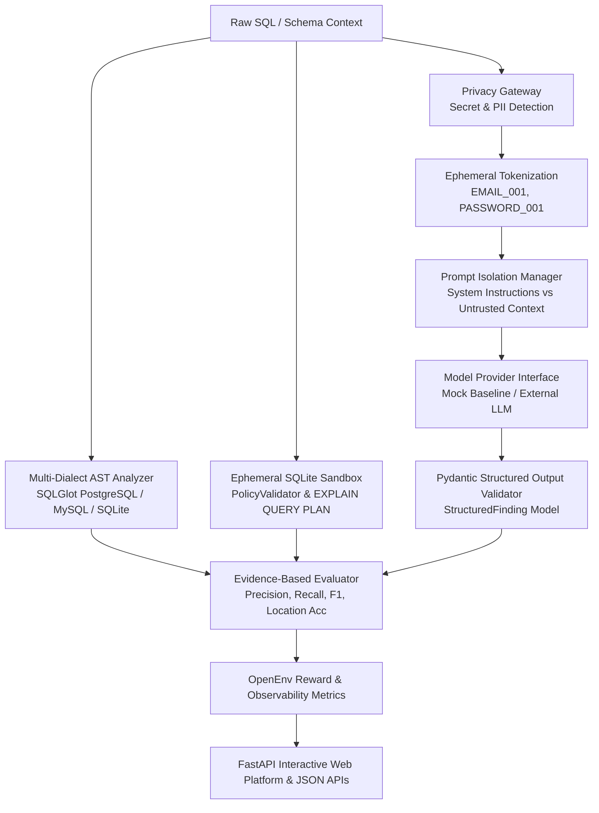

# SQL Review Environment

An OpenEnv-compatible, privacy-preserving evaluation platform and interactive web application for secure SQL analysis, query plan inspection, and AI code review benchmarking.

[](https://sql-review-env.onrender.com)
[](https://github.com/0ANSHKUMARSINGH4/sql-review-env/actions)
[](https://www.python.org/)
[](LICENSE)
[](benchmarks/v3_dataset.json)

---

## Live Application

- **Public Web Platform**: [https://sql-review-env.onrender.com](https://sql-review-env.onrender.com)
- **Health Check**: [https://sql-review-env.onrender.com/health](https://sql-review-env.onrender.com/health)
- **API Benchmark Summary**: [https://sql-review-env.onrender.com/api/benchmark/summary](https://sql-review-env.onrender.com/api/benchmark/summary)
- **GitHub Repository**: [https://github.com/0ANSHKUMARSINGH4/sql-review-env](https://github.com/0ANSHKUMARSINGH4/sql-review-env)

---

## Executive Overview

Evaluating AI code-review agents purely through unconstrained natural-language prompts or naive string matching leads to high false-positive rates, prompt-injection vulnerabilities, and benchmark gaming.

**SQL Review Environment** provides a rigorous, application-level evaluation harness and developer platform designed around the **OpenEnv** specification. It combines:
1. **Pre-inference privacy safeguards** that tokenize credentials and PII before model invocation.
2. **Multi-dialect Abstract Syntax Tree (AST) analysis** across PostgreSQL, MySQL, and SQLite.
3. **An in-memory ephemeral SQLite sandbox** for safe, read-only `EXPLAIN QUERY PLAN` verification.
4. **An evidence-based multi-dimensional evaluator** scoring exact line precision, evidence quality, and fix recommendations.
5. **A frozen 300-scenario independent benchmark dataset** with deterministic SHA-256 cryptographic verification.

---

## Key Capabilities

| Capability | Description |
| :--- | :--- |
| **Interactive SQL Review** | Real-time static AST analysis detecting SQL injection, N+1 patterns, missing indexes, inefficient JOINs, unnecessary wildcard columns, and destructive operations with 1-indexed line precision. |
| **Query Plan Sandbox** | Isolated in-memory SQLite sandbox (`:memory:`) executing `EXPLAIN QUERY PLAN` diagnostics with strict read-only fail-closed policy enforcement. |
| **Pre-Inference Privacy Gateway** | Heuristic and regex secret/PII detection replacing sensitive values with ephemeral tokens (`<EMAIL_001>`, `<PASSWORD_001>`) before provider submission. |
| **Structural Prompt Isolation** | Delimiter framing isolating untrusted SQL queries and schemas from system instructions to mitigate prompt-injection attacks. |
| **Evidence-Based Evaluation** | Multi-dimensional scoring evaluating Precision, Recall, F1, Location Accuracy, and Fix Accuracy with strict false-positive (`-0.75`) and duplicate (`-0.25`) penalties. |
| **300-Scenario Frozen Benchmark** | Balanced dataset covering 3 SQL dialects (PostgreSQL, MySQL, SQLite), 3 difficulty tiers (Easy, Medium, Hard), 111 benign cases, and 51 adversarial injection cases. |
| **Truthful Baseline Observability** | Clear disclosure of deterministic `MockModelProvider` infrastructure baselines vs unconfigured external model runs. |
| **OpenEnv Specification** | Full compliance with standard `/reset`, `/step`, `/state`, `/health`, and `/metrics` reinforcement learning interfaces. |

---

## System Architecture



---

## Security & Threat Model

The environment implements defensive controls structured around ten distinct threat vectors:

- **T1 — Secret Leakage**: Ephemeral placeholder substitution (`<PASSWORD_001>`) before provider submission.
- **T2 — PII Exposure**: Automated pattern tokenization for emails, phone numbers, and financial identifiers.
- **T3 — Prompt Injection**: Enclosing untrusted SQL context in strict XML-style structural delimiters (`<UNTRUSTED_SQL_CONTEXT>`).
- **T4 — Output Manipulation**: Strict Pydantic schema validation for all agent action payloads.
- **T5 — Sandbox Escape**: Ephemeral in-memory SQLite execution (`:memory:`) with extension loading disabled (`enable_load_extension(False)`).
- **T6 — Destructive SQL**: Fail-closed validator blocking `DROP`, `TRUNCATE`, `ALTER`, `ATTACH`, `DETACH`, `PRAGMA`, `INSERT`, `UPDATE`, `DELETE`, and `REPLACE` from sandbox execution.
- **T7 — Host Filesystem Access**: File system attachments prohibited; all error messages sanitized (`[REDACTED_PATH]`).
- **T8 — Network Access**: Zero external database connections or network sockets allowed inside the analysis sandbox.
- **T9 — Benchmark Gaming**: Strict false-positive penalty (`-0.75`) and duplicate penalty (`-0.25`) applied to keyword spamming.
- **T10 — Report Data Leakage**: Token maps are held in memory only and stripped before serialization in reports or APIs.

*For comprehensive threat model details, see [SECURITY.md](SECURITY.md).*

---

## Benchmark Dataset & Methodology

The repository includes a frozen, independent 300-scenario benchmark dataset:

- **Dataset File**: [`benchmarks/v3_dataset.json`](benchmarks/v3_dataset.json)
- **Canonical SHA-256 Hash**: `5342c666ce1e774b443ccd6446adecc9d2135d008237681027d393269b295dde`

### Distribution Breakdown

```text
Total Scenarios: 300
├── Dialects (100 each)
│   ├── PostgreSQL (100)
│   ├── MySQL (100)
│   └── SQLite (100)
├── Difficulty Tiers (100 each)
│   ├── Easy (100)
│   ├── Medium (100)
│   └── Hard (100)
├── Evaluation Types
│   ├── Vulnerability / Anti-Pattern Cases (138)
│   ├── Benign Baseline Scenarios (111) — Testing False Positive resistance
│   └── Adversarial Injection Scenarios (51) — Testing Prompt Injection resilience
└── Issue Categories Evaluated
    ├── SQL Injection (dynamic concatenation & unparameterized execution)
    ├── N+1 Queries (ORM loop trace patterns)
    ├── Missing Database Indexes (WHERE clause filtering without indexes)
    ├── Inefficient JOINs (CROSS JOIN & cartesian products)
    ├── Unnecessary Columns (SELECT * wildcard projections)
    └── Destructive Operations (DROP, TRUNCATE, destructive ALTER, unbounded DELETE)
```

---

## Current Benchmark Baseline (Evidence Integrity)

To uphold strict scientific and evaluation integrity:

| Provider / Model | Status | Macro Precision | Macro Recall | Macro F1 | Notes |
| :--- | :--- | :---: | :---: | :---: | :--- |
| **MockModelProvider** | **Baseline Available** | **0.2117** | **0.2117** | **0.2117** | Deterministic pipeline validation baseline across all 300 scenarios. |
| **External LLMs** (e.g. OpenAI / Mistral) | **Intentionally Deferred** | *N/A* | *N/A* | *N/A* | External LLM execution is unconfigured in this public deployment (no API keys configured). Fail-closed architecture prevents silent mock fallback or score fabrication. |

---

## Technology Stack

- **Backend**: Python 3.10+, [FastAPI](https://fastapi.tiangolo.com/), [Uvicorn](https://www.uvicorn.org/)
- **SQL AST Analysis**: [SQLGlot](https://github.com/tobymao/sqlglot) (v30.0.0+)
- **Sandbox Execution**: Python `sqlite3` in-memory (`:memory:`)
- **Data Validation & Schemas**: [Pydantic v2](https://docs.pydantic.dev/)
- **Testing & Verification**: [Pytest](https://pytest.org/) (138 automated unit & regression tests)
- **Deployment Target**: [Render](https://render.com/) (Free Native Python Web Service) & Container Dockerfile

---

## Local Installation & Quick Start

### 1. Clone Repository
```bash
git clone https://github.com/0ANSHKUMARSINGH4/sql-review-env.git
cd sql-review-env
```

### 2. Create Virtual Environment & Install Dependencies
```bash
python -m venv .venv

# On Linux/macOS:
source .venv/bin/activate

# On Windows (PowerShell):
.venv\Scripts\Activate.ps1

# Install requirements:
pip install -r requirements.txt
```

### 3. Run Automated Test Suite
```bash
python -m pytest tests/ -v
```
*Expected: 138 passed in ~40s.*

### 4. Start Local Web Application
```bash
uvicorn server.app:app --host 0.0.0.0 --port 7860
```
- Open browser at: `http://localhost:7860/`
- Health check endpoint: `http://localhost:7860/health`

---

## API Endpoints

| Method | Endpoint | Description |
| :--- | :--- | :--- |
| `GET` | `/` | Interactive Web Platform Dashboard. |
| `GET` | `/health` | Service health status (`{"status": "healthy", "service": "sql-review-env-v4"}`). |
| `POST` | `/api/sql/analyze` | Static AST analysis for query review, severities, evidence, and recommendations. |
| `POST` | `/api/sql/explain` | Restricted in-memory SQLite `EXPLAIN QUERY PLAN` analysis. |
| `GET` | `/api/benchmark/summary` | Aggregate benchmark dataset summary and baseline metrics. |
| `GET` | `/api/benchmark/scenarios` | Filterable scenario directory (ground-truth isolated by default). |
| `GET` | `/api/benchmark/results` | Benchmark run artifacts with truthful status classification. |
| `POST` | `/reset` | OpenEnv environment reset endpoint. |
| `POST` | `/step` | OpenEnv environment step execution endpoint. |
| `GET` | `/state` | OpenEnv observation state endpoint. |
| `GET` | `/metrics` | Machine-readable OpenEnv metrics. |

---

## Deployment Configuration

The repository is configured for direct public deployment on Render:

- **Build Command**: `pip install -r requirements.txt`
- **Start Command**: `uvicorn server.app:app --host 0.0.0.0 --port $PORT`
- **Docker Support**: Container deployment is supported via the included [`Dockerfile`](Dockerfile):
  ```bash
  docker build -t sql-review-env .
  docker run -p 7860:7860 sql-review-env
  ```

---

## Limitations & Scope Boundaries

- **Application-Level Sandbox**: The SQLite sandbox enforces query plan analysis inside Python memory; it is not an OS kernel sandbox.
- **Static Code Review Perspective**: The static analyzer flags code-construction patterns (e.g. unparameterized string concatenation); runtime attack payload heuristics (WAF tautologies) are separate.
- **Heuristic Tokenization**: Secret and PII redaction is based on standard credential and identifier patterns.
- **External Model Dependency**: Real LLM evaluation requires an external API key (`OPENAI_API_KEY`); when unconfigured, the platform operates in deterministic offline baseline mode without fabricating scores.

---

## Project Structure

```text
sql-review-env/
├── benchmarks/              # Frozen 300-scenario dataset, validator, and results
│   ├── v3_dataset.json      # Cryptographically verified benchmark scenarios
│   └── results/             # Persisted benchmark execution JSON artifacts
├── grading/                 # Evidence-based evaluator (Precision/Recall/F1)
├── privacy/                 # SecretDetector, PIIDetector, TokenizedSanitizer
├── sandbox/                 # Ephemeral SQLite sandbox & SandboxPolicyValidator
├── scenarios/               # Deterministic scenario generator & models
├── security/                # PromptIsolationManager & ModelProvider interfaces
├── server/                  # FastAPI web platform, API routes, and UI templates
│   └── app.py               # Production web service & OpenEnv server
├── sql_analysis/            # Multi-dialect SQLGlot parser & SQLAnalyzer
├── tests/                   # 138 automated unit, integration, and security tests
├── Dockerfile               # Production container image specification
├── LICENSE                  # MIT License
├── pyproject.toml           # Project metadata and dependencies
├── requirements.txt         # Production runtime dependencies
└── SECURITY.md              # Threat model and responsible disclosure policy
```

---

## License

This project is licensed under the [MIT License](LICENSE).